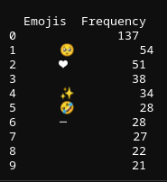

```{r, include=FALSE}
library(reticulate)
```


<!-- ## Import necessary libraries and reading csv -->
```{python, include = FALSE}
import re
import pandas as pd

tweets = pd.read_csv("tweets 2.csv")
```

<!-- ## Define extraction functions -->
```{python, include=FALSE}
def extract_hashtags(text):
    hashtags = re.findall(r'#(\w+)', text)
    return hashtags

def extract_users(text):
    users = re.findall(r'@(\w+)', text)
    return users

def extract_urls(text):
    urls = re.findall(r"(?:https?://|www\.|ftp\.)(?:[A-Za-z\d\-_]+(?:\.[A-Za-z\d\-_]+)*)(?:/[^\s]*)?",text)
    return urls

def extract_times(text):
    times = re.findall(r'\b(?:1[012]|0?[0-9]):[0-5][0-9]\s*(?:[ap]\.?m\.?)?\b',
                      text, re.IGNORECASE)
    return times

def extract_emoticons(text):
    emoticons = re.findall(r'(?::|;|=)(?:-)?(?:\)|\(|D|P)', text)
    return emoticons

def extract_emojis(text):
    emojis = ''.join(re.findall(r'[\U0001F300-\U0001F5FF]|[\U0001F600-\U0001F64F]\
    |[\U0001F680-\U0001F6FF]|[\U0001F700-\U0001F77F]|[\U0001F780-\U0001F7FF]\
    |[\U0001F800-\U0001F8FF]|[\U0001F900-\U0001F9FF]|[\U0001FA00-\U0001FA6F]\
    |[\U0001FA70-\U0001FAFF]|[\U00002702-\U000027B0]|[\U000024C2-\U0001F251]', text))
    return emojis
```

<!-- ## Apply functions to extract required information -->
```{python, include=FALSE}
tweets['hashtags'] = tweets['text'].apply(extract_hashtags)
tweets['users'] = tweets['text'].apply(extract_users)
tweets['urls'] = tweets['text'].apply(extract_urls)
tweets['times'] = tweets['text'].apply(extract_times)
tweets['emoticons'] = tweets['text'].apply(extract_emoticons)
tweets['emojis'] = tweets['text'].apply(extract_emojis)
```

<!-- ## Count frequency  -->
```{python, include=FALSE}
flatten = lambda l: [item for sublist in l for item in sublist]

hashtags_freq = pd.Series(flatten(tweets['hashtags'])).value_counts()
users_freq = pd.Series(flatten(tweets['users'])).value_counts()
urls_freq = pd.Series(flatten(tweets['urls'])).value_counts()
times_freq = pd.Series(flatten(tweets['times'])).value_counts()
emoticons_freq = pd.Series(flatten(tweets['emoticons'])).value_counts()
emojis_freq = pd.Series(flatten(tweets['emojis'])).value_counts()
```

<!-- ## Create data frames to save data -->
```{python, include=FALSE}
hashtags_df = pd.DataFrame({'hashtags': hashtags_freq.index, 'Frequency': hashtags_freq.values})
users_df = pd.DataFrame({'Users': users_freq.index, 'Frequency': users_freq.values})
urls_df = pd.DataFrame({'URLs': urls_freq.index, 'Frequency': urls_freq.values})
times_df = pd.DataFrame({'Times': times_freq.index, 'Frequency': times_freq.values})
emoticons_df = pd.DataFrame({'Emoticons': emoticons_freq.index,
                              'Frequency': emoticons_freq.values})
emojis_df = pd.DataFrame({'Emojis': emojis_freq.index, 'Frequency': emojis_freq.values})

top_10_hashtags = hashtags_df.head(10)
top_10_users = users_df.head(10)
top_10_urls = urls_df.head(10)
top_10_times = times_df.head(10)
top_10_emoticons = emoticons_df.head(10)
top_10_emojis = emojis_df.head(10)
```

## Top 10 hashtags
```{python, results = "asis"}
print(top_10_hashtags.to_markdown(index=False))
```
<!-- \newpage -->

## Top 10 users
```{python, results = "asis"}
print(top_10_users.to_markdown(index=False))
```
\newpage

## Top 10 urls
```{python, results = "asis"}
print(top_10_urls.to_markdown(index=False))
```

## Top 10 times
```{python, results = "asis"}
print(top_10_times.to_markdown(index=False))
```

## Top 10 emoticons
```{python, results='asis'}
print(top_10_emoticons.to_markdown(index=False))
```
\newpage

## Top 10 emojis
```{python, eval=FALSE}
top_10_emojis
```

The last chunk of code isn't executed since it cannot be displayed by LATEX due to some encoding issues. However, i'll add an image of the actual output:  

